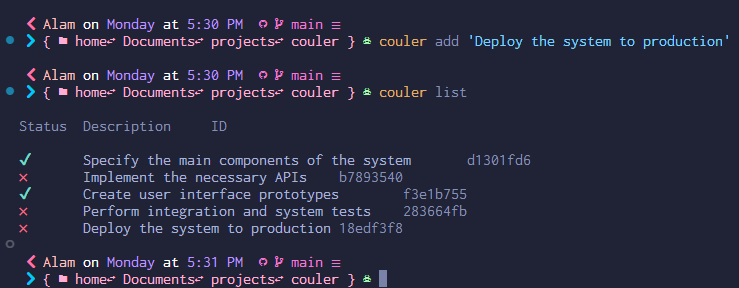

# Couler: A CLI to manage task

<div style="display:block;justify-content:center;">
    
<div>

## How to use

### Installation

```bash
pip install git+https://github.com/alamguardin/couler.git
```

## How to use

### Start a new project

```bash
couler init
```

### Add new task

### Creando una tarea

```bash
couler add <description>
```

### Show tasks list
```bash
couler list
```

### Mark the task as completed
```bash
couler check <id-task>
```

### Delete some task

```bash
couler delete <id-task>
```